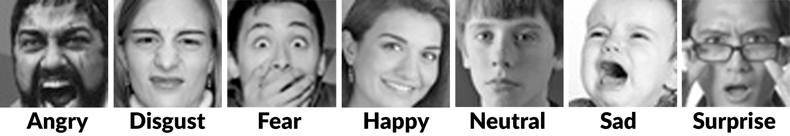
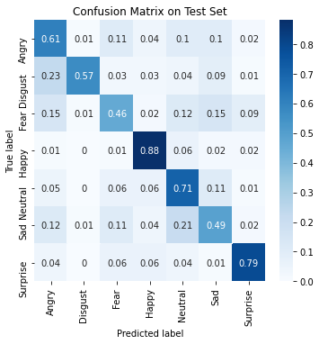
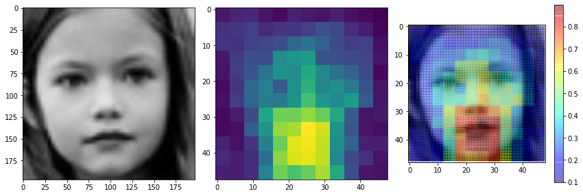

# Emotion Detection with Ensemble-based CNN
## Introduction 
Facial expression is one of the most powerful, natural, and universal signals for human beings to convey their emotional states and intentions. This repository contains our work of performing transfer learning on state-of-the-art CNN models, including residual and VGG neural networks. We performed an ensemble method on individual networks and were able to achieve an accuracy of 72.9%, which is a significant performance gain. For error analysis, we used confusion matrices and occlusion-based saliency maps for further analysis and better interpretability of the results.
## Dataset
FER2013 is our primary dataset for training and testing our models. The `Dataset` folder contains preprocessed face images. The original FER2013 dataset can be downloaded from [here](https://www.kaggle.com/msambare/fer2013). Our preprocessing uses affine transformation and illumination normalization.

## Models
Our models include a vanilla CNN baseline model and fine-tuned ResNet18, ResNet50, SENet50, and VGG16. All models except the baseline model are pretrained on VGGFace2. The pretrained weights are obtained from [here](https://github.com/rcmalli/keras-vggface). Our ensemble model is included in `ensemble.ipynb`.
The pretrained weights are shared via [Google Drive](https://drive.google.com/drive/folders/1N0e_0IhzsXQUWd5LxWyLw6opMeucPn4G?usp=sharing).
## Error Analysis
The confusion matrices are generated from `error_analysis.ipynb`. The occlusion-based saliency maps are generated from `visualization.ipynb`. Some samples can be found in the `results` folder:

Confusion matrix of ResNet50:

Occlusion-based saliency map of SENet50:

## Video
As required by the class, we recorded a [video](https://drive.google.com/file/d/1FK9Fy23ziX9rP_OrmA6c16VkCf_t0Zga/view?usp=sharing) for presenting our work.
## Acknowledgement
This project is inspired by the [awesome project](https://github.com/amilkh/cs230-fer) by Amil Khanzada *et al.* And many thanks to my super awesome teammates Zhiyi (Amelia) Kuang and Yuxin (Abbey) Pei:D
